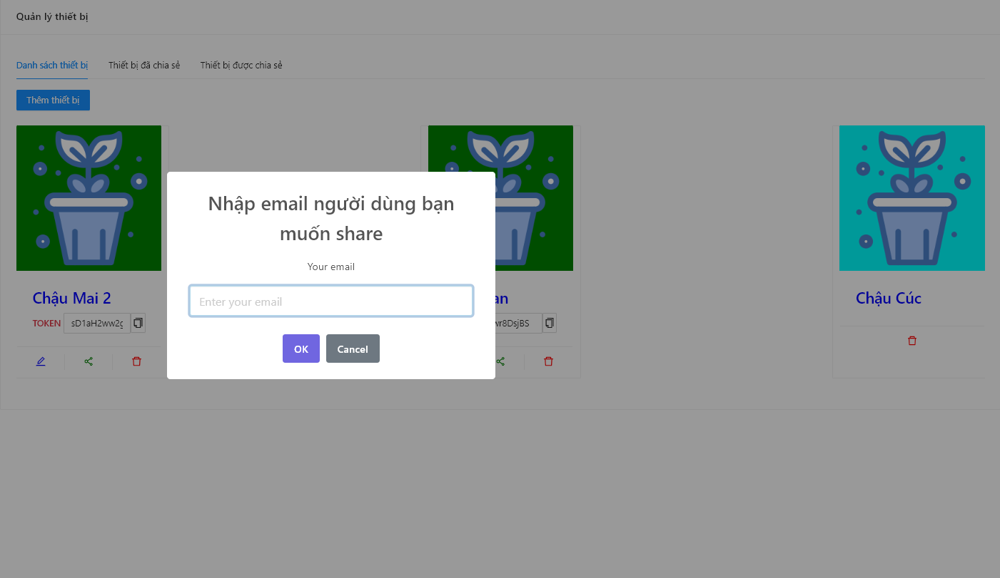

# Dự Án Chậu Cây Thông Minh

Xây dựng hệ thống quản lý chậu cây thông minh IOT

- Đo độ ẩm, nhiệt độ.
- Nếu nhiệt độ cao vượt mức cho phép sẽ kích hoạt đèn hoặc độ ẩm giảm quá mức thì sẽ kích hoạt hệ thống tưới.
- Đưa các thông số đến người dùng qua giao diện web.
- Điều chỉnh, cấu hình thủ công và tự động.
- Hẹn giờ.
- Thống kê số đo.
- Nhận diện bệnh qua hình ảnh.

## Require && Install

**Front End**
```
    git clone git@github.com:DacHoaGit/pots-smart-frontend.git
```
**Back End API**
```
    git clone git@github.com:DacHoaGit/pots-smart-api.git
``` 
**Code Hardware**
```
    git clone git@github.com:DacHoaGit/pots-smart-hardware.git
``` 

## Results
**Giao diện trang chủ**


**Giao diện quản lý thiết bị**




**Giao diện tổng quan**


**Giao diện điều khiển**


**Giao diện chia sẻ**


**Giao diện hẹn giờ**

